# ⚠️ DEPERECATED / ARCHIVED ⚠️

> **⛔ SECURITY WARNING:** This project is a **Legacy Learning Project**. It contains **CRITICAL SECURITY VULNERABILITIES** (e.g., plaintext passwords, hardcoded keys) and poor architectural patterns. It should **NOT** be used in production or as a reference for modern Django development.

---

### 🚀 Check out the Successor: Amanzon
I have built a completely new, production-ready e-commerce application from scratch applying modern best practices. 
👉 **New Repo:** [Amanzon GitHub Repo](https://github.com/qtremors/amanzon)
👉 **Live Demo:** [Amanzon Website](https://amanzon.onrender.com)

---

# 🏦 E-Shopper Django E-commerce Project (Legacy)

A full-featured e-commerce website built with **Python** and the **Django** framework. This project uses the "**EShopper**" HTML template as its frontend and provides a complete user experience, including storefront, cart, orders, and account management.

---


### 🖼️ Image Gallery

| | |
|:---:|:---:|
| 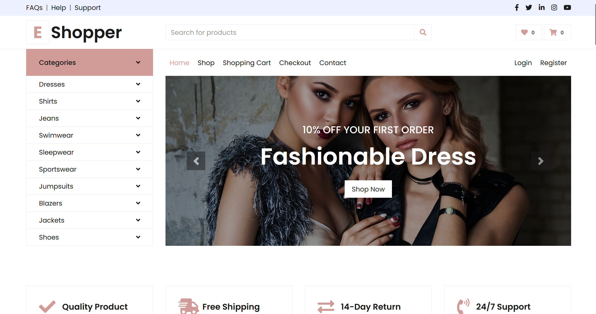 | ") |
| 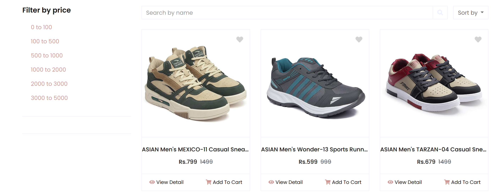 | 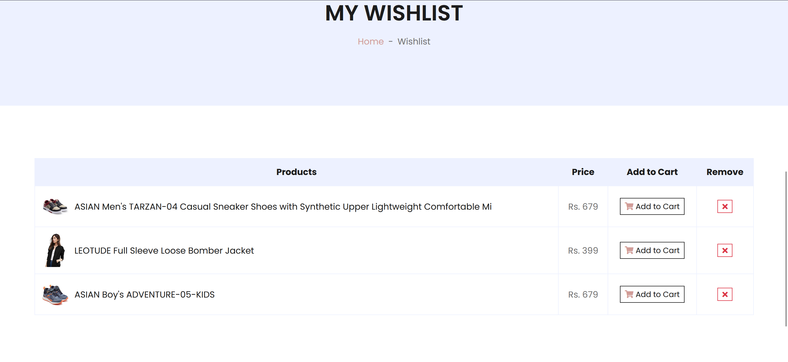 |
| 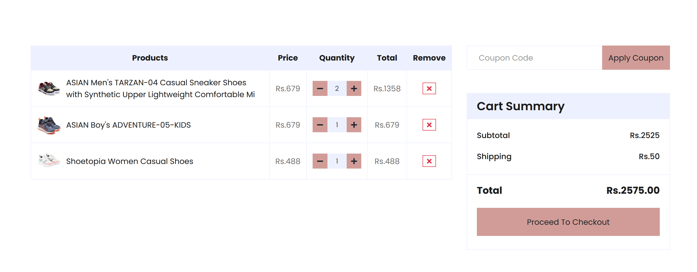 | 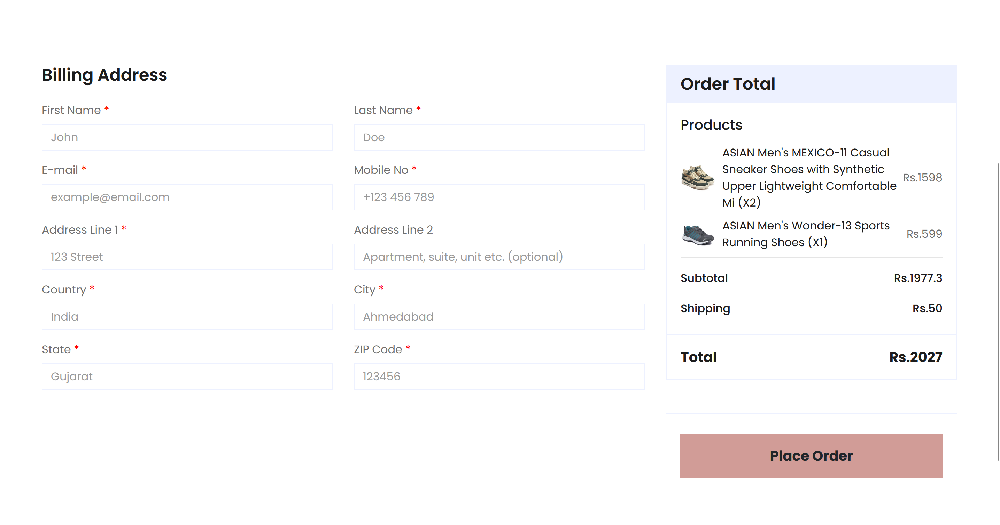 |
| 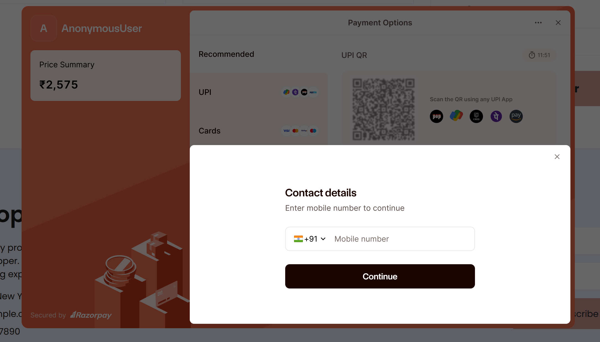 | 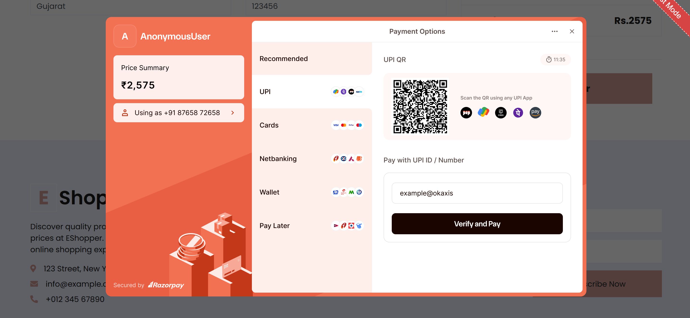 |
| 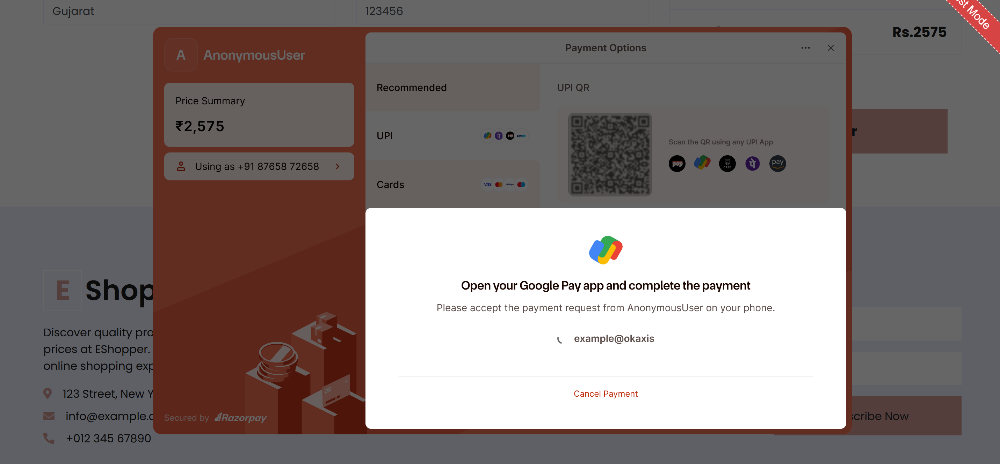 | 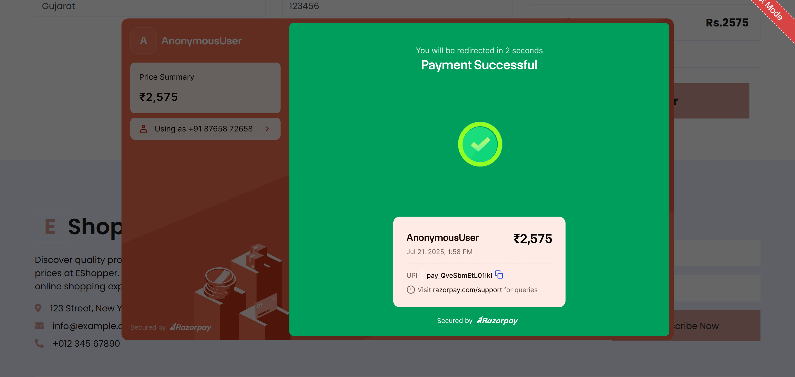 |
| 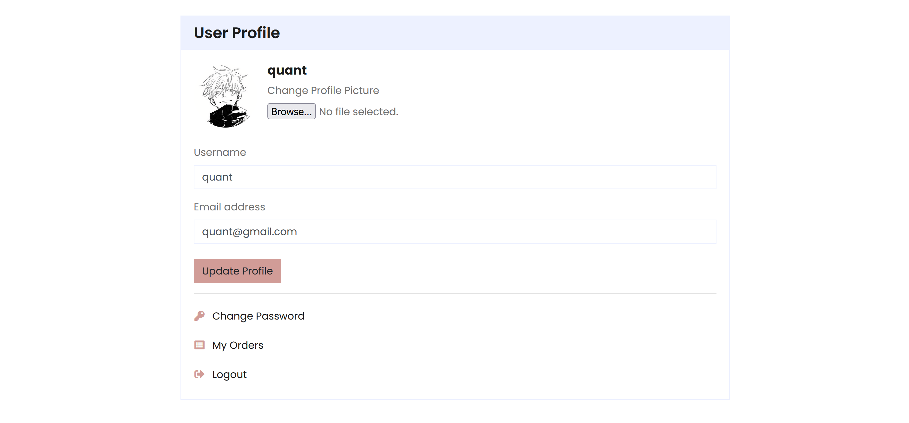 | 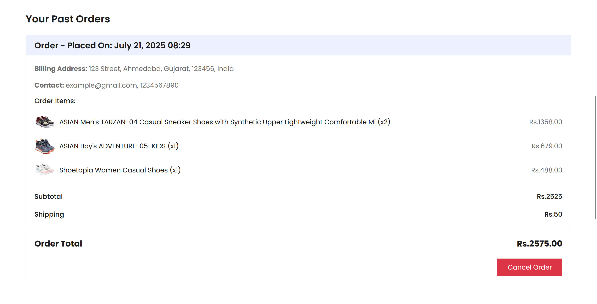 |


---

## ✨ Features

* **User Authentication**: Registration, login, logout
* **User Profile**: Update profile info including username, email, and profile picture
* **Password Reset**: Full flow with email OTP confirmation
* **Product Catalog**: Categorized product listings with sub-categories
* **Advanced Search/Filter**: Search by name and filter by price
* **Shopping Cart**: Add, update, and remove items
* **Wishlist**: Save products for later
* **Coupons**: Apply discount codes in the cart
* **Secure Checkout**: Multi-step checkout with Razorpay integration
* **Order History**: View previous orders and statuses
* **Product Reviews**: Leave ratings and comments
* **Contact Form**: Users can submit inquiries directly

---

## 🛠️ Tech Stack

| Component    | Technology                               |
| ------------ | ---------------------------------------- |
| **Backend**  | Python, Django                           |
| **Frontend** | HTML, CSS, Bootstrap, JavaScript, jQuery |
| **Database** | Django ORM (default: SQLite)             |
| **Payments** | Razorpay                                 |
| **Email**    | Django SMTP backend                      |

---

## 🚀 Setup & Installation

### 1. Prerequisites

* Python 3.8+
* pip

### 2. Clone the Repository

```bash
git clone https://github.com/qtremors/eshopper
cd shopping
```

### 3. Create and Activate Virtual Environment

**Windows:**

```bash
python -m venv venv
venv\Scripts\activate
```

**macOS/Linux:**

```bash
python3 -m venv venv
source venv/bin/activate
```

### 4. Install Dependencies

Ensure `requirements.txt` exists (generate with `pip freeze > requirements.txt` if needed):

```bash
pip install -r requirements.txt
```

### 5. Configure Settings

Edit `shopping/settings.py`:

* Set `SECRET_KEY`
* Configure database (optional if using SQLite)
* Setup SMTP Email:

```python
EMAIL_BACKEND = 'django.core.mail.backends.smtp.EmailBackend'
EMAIL_HOST = 'smtp.gmail.com'
EMAIL_USE_TLS = True
EMAIL_PORT = 587
EMAIL_HOST_USER = 'your-email@gmail.com'
EMAIL_HOST_PASSWORD = 'your-app-password'
```

* Add Razorpay keys:

```python
RAZORPAY_KEY_ID = 'YOUR_KEY_ID'
RAZORPAY_KEY_SECRET = 'YOUR_KEY_SECRET'
```

### 6. Run Migrations

```bash
python manage.py migrate
```

### 7. Create Superuser (for Admin Panel)

```bash
python manage.py createsuperuser
```

### 8. Start the Development Server

```bash
python manage.py runserver
```

Visit: [http://127.0.0.1:8000/](http://127.0.0.1:8000/)

---

## ⚠️ Important Notes & Known Issues

* ❌ **Critical Security Flaw**: Passwords are stored in **plaintext**. Replace with Django's `make_password()` and `check_password()` for hashing.
* ⛔ **Hardcoded API Keys**: Razorpay keys are currently in `views.py`. Move to `settings.py` to protect sensitive info.

---


## 🙏 Acknowledgments

* Frontend UI based on **EShopper template** by [HTML Codex](https://htmlcodex.com)
